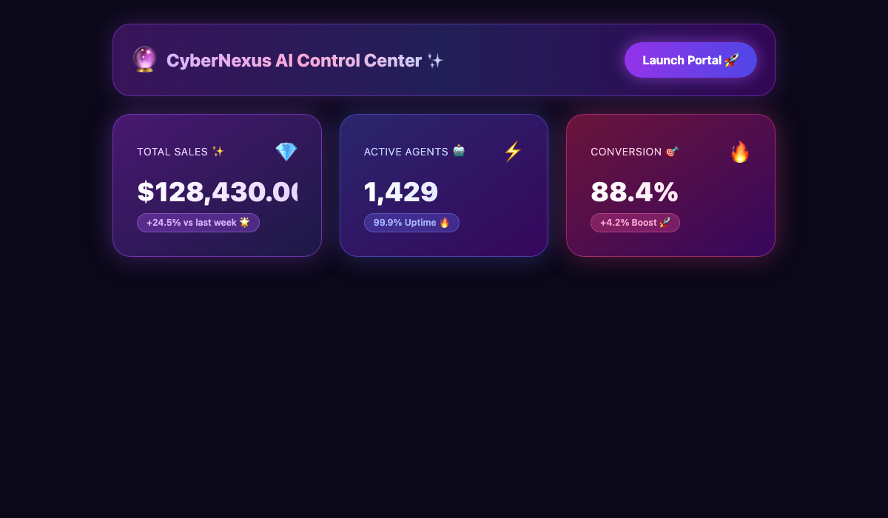
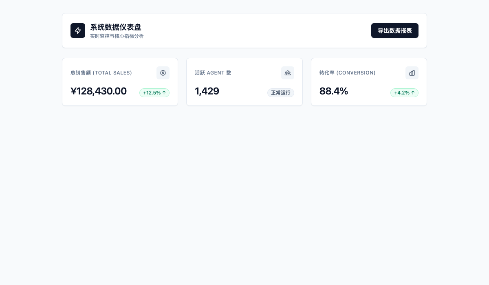
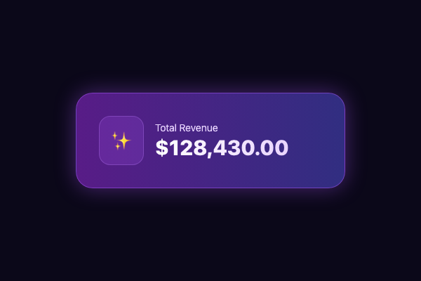
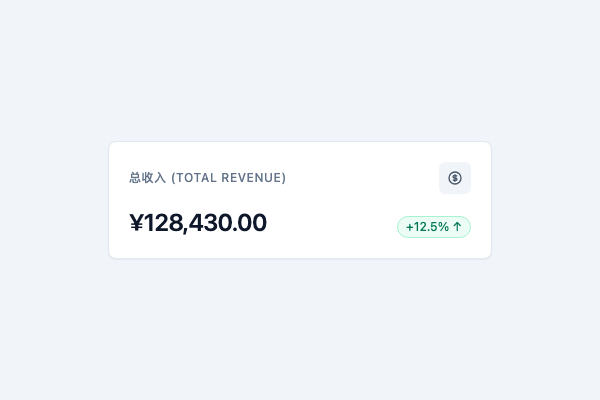

# 拒绝“AI 塑料感”：如何让 AI 生成的界面秒变产品级 UI？

用 V0、Bolt.new 或 Cursor 生成 UI 确实非常爽，几秒钟就能吐出一整套前端代码。但相信不少开发者和设计师都有同感：**AI 生成的界面一眼就能看出来是“AI 做的”**。

大面积的黑紫渐变背景、自带炫光效果的边框、极其夸张的大圆角（`rounded-3xl`）、悬浮的 3D 水晶球小人……这种看似炫酷实则同质化严重、缺乏真实业务逻辑的视觉表现，被业内戏称为“AI 塑料感”（AI Slop）。

那么，如何摆脱这种同质化的“AI 味”，让生成出来的界面达到真正能直接落地的产品级质量？本文从 **AI 的生成机制**、**开源设计规范约束** 以及 **新旧界面的实操重构** 三个方面，整理了一套避坑指南。
![[ai-ui-cover.png]]
---

## 一、 AI 味界面的五大典型特征

在重构之前，先看看你的界面是否中了以下几条：

| 视觉与交互维度 | AI 味界面的典型表现 | 真实产品级 UI 的标准做法 |
| :--- | :--- | :--- |
| **配色方案** | 习惯用黑紫/深青渐变背景 + 高饱和霓虹发光边框 (`shadow-[0_0_20px_purple]`) | 以中性灰阶为主（如 Slate/Neutral），品牌色作局部点缀，对比度达标 |
| **圆角与阴影** | 动辄使用 `rounded-3xl` 大圆角，配上浮夸的漫反射重阴影 | 容器圆角收敛在 `6px - 8px` (`rounded-md`)，配 1px 细边框或轻微自然阴影 |
| **视觉锚点** | 卡片套卡片（Card-in-Card），信息没有焦点，什么都想突出 | 留白得当，通过字号与字重划分阶梯，建立清晰的阅读视觉锚点 |
| **图标与视觉元素** | 混用 Emoji、3D 浮空玻璃球或渲染小人，图标风格五花八门 | 统一使用极简线框图标库（如 Lucide / Heroicons），风格保持一致 |
| **状态容错** | 只有静态形态，缺少 Hover/Active 状态，没有考虑到空数据和长文本溢出 | 交互状态完整，包含 Loading、Empty、Error 状态，且对长文本容错性好 |

---

## 二、 为什么 AI 总是喜欢画“塑料黑紫风”？

很多开发者好奇，为什么不同模型生成的界面看起来都像“同一个模子出来的”？原因主要有四点：

1. **训练数据中的“概念设计稿”过拟合**：AI 在预训练阶段吸收了大量 Dribbble、Behance 上的概念展示稿。这类稿子为了展示效果往往偏爱赛博朋克风和强光影，AI 从统计学上误以为这就是人类眼中的“好设计”。
2. **缺乏真实业务与可读性约束**：人类设计师要考虑 WCAG 文字对比度、多语言适配、开发落地成本；而 AI 在没有设计规范（Design Tokens）约束时，习惯用夸张的渐变和发光来掩盖真实逻辑的缺失。
3. **模型的“统计平均化”效应**：未限定风格时，AI 会输出概率最高的高频组合。目前各大 AI 的默认高频组合就是：`黑紫背景 + 渐变发光 + rounded-3xl + 3D Emoji`。
4. **工具底层默认 System Prompt 偏好**：v0、Bolt 等工具在底层提示词里预设了偏炫酷的样式，以便在第一眼吸引用户。

---

## 三、 用开源 UI SKILL 建立规则约束

要让 AI 摆脱塑料感，最有效的办法是在写 Prompt 或配置 `.cursorrules` 时，直接接入成熟的开源 UI 规范与 Token：

1. **[Shadcn UI](https://ui.shadcn.com/)（组件范式）**：基于 Tailwind CSS + Radix UI，结构极简、无冗余视觉污染，是消除 AI 味的首选规范。
2. **[Lucide Icons](https://lucide.dev/)（图标体系）**：风格统一的线性图标库，粗细保持在 1.5px / 2px，直接替换掉复杂的 3D 图片。
3. **[Tailwind Color Palette](https://tailwindcss.com/docs/customizing-colors)**：直接限定 AI 使用 `slate` 或 `neutral` 语义化灰阶，禁止自由发挥高饱和发光色。

---

## 四、 两种场景下的去 AI 味实操步骤

### 1. 从 0 到 1 首次生成：在 Prompt 源头加约束

#### 步骤 1：准备带有开源设计规范的 Prompt
向 AI 描述需求时，显式加上设计 Tokens 和规范约束：

```markdown
请设计一个 SaaS 仪表盘界面，遵循以下 Shadcn UI 设计规范：
- 风格：工程化中性风格，严禁使用黑紫渐变背景和发光边框。
- 色彩：主色 Slate-900，背景 White / Slate-50，边框 1px border-slate-200。
- 容器：圆角统一控制在 6px (rounded-md)，阴影使用轻微 shadow-sm。
- 图标：统一使用 Lucide React 细线框图标。
```

#### 步骤 2：对比不加约束的初稿
如果不加约束，AI 默认会输出具有强烈发光与大圆角的界面：



#### 步骤 3：提交规范 Prompt 并导出
将带规范约束的 Prompt（主要包含 Shadcn UI 规范、Tailwind Slate 色彩 Token 及 Lucide 图标）提交给 AI，生成的代码就会回归到干净透亮的产品级结构：



---

### 2. 对现有 AI 味界面进行代码重构

如果你手头已经有一套带有强“AI 味”的代码，可以通过以下几步快速重构：

#### 步骤 1：定位视觉噪音
找出代码中不必要的发光阴影、深色渐变以及大圆角。



#### 步骤 2： CSS/Tailwind 色彩与边框降级
清理夸张的样式，将其替换为中性灰阶和细边框：

```css
/* 修改示例 */
- background: linear-gradient(135deg, #0f0c20 0%, #150d30 100%);
- box-shadow: 0 0 25px rgba(168, 85, 247, 0.4);
- border-radius: 1.5rem; /* rounded-3xl */

+ background: #ffffff;
+ border: 1px solid #e2e8f0; /* border-slate-200 */
+ box-shadow: 0 1px 2px 0 rgba(0, 0, 0, 0.05); /* shadow-sm */
+ border-radius: 0.375rem; /* rounded-md */
```

#### 步骤 3：统一字号层级与图标
- 将 Emoji/3D 图片替换为 `Lucide` 矢量图标。
- 重排字号阶梯：标题使用 `18px / font-semibold`，辅助说明使用 `12px text-slate-500`。

#### 步骤 4：补齐交互态与超长文本适配
给按钮和输入框补上 `hover:`、`focus:` 交互态，给文本节点加上 `truncate` 适应变长数据。

#### 步骤 5：刷新检查重构效果
重构后的卡片整体信息层次更加清晰，褪去了塑料感：



---

## 五、 实战代码对比

### 场景：Dashboard 统计卡片

#### ❌ 重构前：AI 味浓厚的卡片代码（黑紫渐变、发光、字体无对比）
```html
<div class="bg-gradient-to-r from-purple-900 to-indigo-900 p-8 rounded-3xl border border-purple-500/50 shadow-[0_0_30px_rgba(168,85,247,0.3)]">
  <div class="flex items-center gap-4">
    <div class="p-4 bg-purple-500/20 rounded-2xl border border-purple-400/30">
      <span class="text-3xl">✨</span>
    </div>
    <div>
      <p class="text-purple-200 text-sm font-light">Total Revenue</p>
      <h3 class="text-3xl font-extrabold text-transparent bg-clip-text bg-gradient-to-r from-white to-purple-200">$128,430.00</h3>
    </div>
  </div>
</div>
```

#### ✅ 重构后：产品级干净卡片代码（中性灰阶、细边框、信息聚焦）
```html
<div class="bg-white p-5 rounded-lg border border-slate-200 shadow-sm hover:border-slate-300 transition-colors">
  <div class="flex items-center justify-between mb-3">
    <span class="text-xs font-medium text-slate-500 uppercase tracking-wider">总收入 (Total Revenue)</span>
    <div class="p-2 bg-slate-100 rounded-md text-slate-600">
      <svg class="w-4 h-4" ...></svg>
    </div>
  </div>
  <div class="flex items-baseline justify-between">
    <span class="text-2xl font-semibold text-slate-900 tracking-tight">¥128,430.00</span>
    <span class="inline-flex items-center text-xs font-medium text-emerald-600 bg-emerald-50 px-2 py-0.5 rounded-full">
      +12.5% ↑
    </span>
  </div>
</div>
```

---

## 六、 产品上线前自查清单

产品交付前，可以对照以下清单进行快速核对：

- [ ] 是否去除了所有不必要的发光外阴影 (`box-shadow`) 和高饱和渐变背景？
- [ ] 容器圆角是否均收敛在 `6px - 8px` 之间？
- [ ] 页面中的标题、正文、次要信息是否有清晰的字号与字重梯度？
- [ ] 图标风格是否统一（是否全部使用同一个矢量库）？
- [ ] 长文本、大金额场景下页面是否会出现样式错乱？
- [ ] 按钮和输入框是否有正常的 Hover、Focus 和 Disabled 交互状态？
