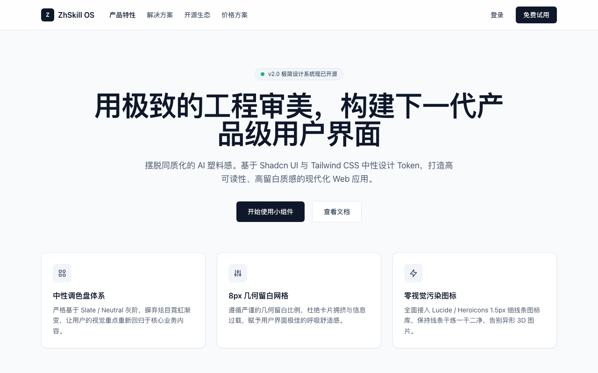

# 突破同质化：如何让 AI 生成的 UI 拥有高级感审美？

用 V0、Cursor 或 Bolt 生成 UI 时，很多人都有过这样的困惑：功能虽然都能生成出来，但**视觉效果总觉得“差一口气”**——要么粗糙得像十年前的旧模板，要么花哨得像游戏网页。

真正的高质感界面（High-Craft UI），本质上并不依赖花哨的 3D 图案或高饱和发光渐变，而是来自于**极简的信息层级、严谨的 8px 几何网格留白、通透的中性灰阶层次，以及极致的 Typography（排版字号阶梯）**。

本文汇总了提升 AI UI 审美的底层法则与开源 SKILL 工具链，并通过 **官网首页** 与 **管理后台首页** 两个具体的 HTML 实操项目，展示如何利用规范约束让 AI 吐出产品级质感的界面。

---

## 一、 高质感 UI 审美的四大底层法则

想要控制 AI 的审美输出，首先需要明确高级感界面的客观构成规律：

### 1. 配色法则：中性单色调 + 语义微调 (Monochromatic & Subtle Grays)
- 优秀 UI 90% 以上的区域是由 Neutral / Slate 冷灰阶构成的。
- 主品牌色只用于最核心的 CTA (Call to Action) 按钮和少数状态 Badge，杜绝大面积填充高饱和发光色。

### 2. 留白法则：8px 几何网格与呼吸感 (Spacious Rhythm)
- 普通 UI 把元素挤在一块，高级 UI 敢于留白。
- 内外边距 (Padding & Margin) 严格遵守 `8px / 16px / 24px / 32px / 48px` 网格梯度，为阅读建立清晰的视觉节奏。

### 3. 排版法则：紧凑字间距与字重对比 (Typography Scale)
- 大标题使用 `tracking-tight` (字间距收紧) + `font-semibold`，避免标题显得松散。
- 次要说明文字降低颜色对比度（使用 `text-slate-500`），而不是频繁更换字号。

### 4. 质感法则：1px 细边框与低调沉淀 (1px Border & Subtle Elevation)
- 抛弃漫反射发光外阴影，改用轻盈的 1px 细边框 (`border border-slate-200`) 与极淡的微阴影 (`shadow-sm`)。

---

## 二、 推荐开源 UI 审美 SKILL 与工具链

通过将以下开源生态与规则注入 AI 工具，可以全自动锁定生成的审美下限：

1. **[Shadcn UI](https://ui.shadcn.com/)**：无冗余视觉污染，目前前端公认最符合现代高级审美的开源组件设计规范。
2. **[Tailwind CSS Slate Palette](https://tailwindcss.com/docs/customizing-colors)**：开箱即用的专业中性灰阶调色盘，比纯黑白更具质感。
3. **[Lucide Icons](https://lucide.dev/)**：1.5px 极细线框矢量图标库，线条干练，无视觉噪音。
4. **[awesome-cursorrules](https://github.com/punkpeye/awesome-cursorrules)**：在项目根目录注入 `.cursorrules` 文件，把高审美规则沉淀为 AI 自动执行的 Skill。

---

## 三、 实战示例一：高审美官网首页 (Landing Page)

### 1. 设计要点
- **导航栏**：采用 `bg-white/80 backdrop-blur-md` 半透明模糊背景与 1px 底部分割线。
- **Hero 区域**：字号拉开对比（5xl 标题 + 18px 辅助文案），两端留白充足。
- **特性卡片**：使用 `bg-white border-slate-200 shadow-sm`，结合微弱的 Hover 边框加深效果。

### 2. 渲染效果截图



### 3. 完整 HTML 实操代码

```html
<!DOCTYPE html>
<html lang="zh-CN">
<head>
  <meta charset="UTF-8">
  <title>高审美官网首页示例 (Landing Page)</title>
  <script src="https://cdn.tailwindcss.com"></script>
  <style>
    body { font-family: -apple-system, BlinkMacSystemFont, "Segoe UI", Roboto, sans-serif; }
  </style>
</head>
<body class="bg-slate-50 text-slate-900 min-h-screen antialiased">
  <!-- 顶部导航栏 -->
  <header class="sticky top-0 z-50 bg-white/80 backdrop-blur-md border-b border-slate-200">
    <div class="max-w-6xl mx-auto px-6 h-16 flex items-center justify-between">
      <div class="flex items-center gap-8">
        <div class="flex items-center gap-2 font-semibold text-slate-900">
          <div class="w-7 h-7 rounded-md bg-slate-900 flex items-center justify-center text-white text-xs font-bold">Z</div>
          <span>ZhSkill OS</span>
        </div>
        <nav class="hidden md:flex items-center gap-6 text-sm font-medium text-slate-600">
          <a href="#" class="text-slate-900">产品特性</a>
          <a href="#" class="hover:text-slate-900 transition-colors">解决方案</a>
          <a href="#" class="hover:text-slate-900 transition-colors">开源生态</a>
          <a href="#" class="hover:text-slate-900 transition-colors">价格方案</a>
        </nav>
      </div>
      <div class="flex items-center gap-3">
        <button class="px-3.5 py-1.5 text-sm font-medium text-slate-700 hover:text-slate-900 transition-colors">登录</button>
        <button class="px-4 py-2 text-sm font-medium bg-slate-900 text-white rounded-md hover:bg-slate-800 transition-colors shadow-sm">免费试用</button>
      </div>
    </div>
  </header>

  <!-- Hero 区域 -->
  <section class="max-w-6xl mx-auto px-6 pt-20 pb-16 text-center">
    <div class="inline-flex items-center gap-2 px-3 py-1 rounded-full bg-slate-100 border border-slate-200 text-xs font-medium text-slate-600 mb-6">
      <span class="w-2 h-2 rounded-full bg-emerald-500"></span>
      <span>v2.0 极简设计系统现已开源</span>
    </div>
    <h1 class="text-5xl md:text-6xl font-semibold tracking-tight text-slate-900 max-w-4xl mx-auto leading-[1.15]">
      用极致的工程审美，构建下一代产品级用户界面
    </h1>
    <p class="mt-6 text-lg text-slate-600 max-w-2xl mx-auto font-normal leading-relaxed">
      摆脱同质化的 AI 塑料感。基于 Shadcn UI 与 Tailwind CSS 中性设计 Token，打造高可读性、高留白质感的现代化 Web 应用。
    </p>
    <div class="mt-8 flex items-center justify-center gap-4">
      <button class="px-6 py-3 text-sm font-medium bg-slate-900 text-white rounded-md hover:bg-slate-800 transition-colors shadow-sm">开始使用小组件</button>
      <button class="px-6 py-3 text-sm font-medium bg-white text-slate-700 border border-slate-200 rounded-md hover:bg-slate-50 transition-colors">查看文档</button>
    </div>
  </section>

  <!-- 特性卡片区域 -->
  <section class="max-w-6xl mx-auto px-6 pb-20">
    <div class="grid md:grid-cols-3 gap-6">
      <div class="bg-white p-6 rounded-xl border border-slate-200 shadow-sm hover:border-slate-300 transition-all">
        <div class="w-10 h-10 rounded-lg bg-slate-100 flex items-center justify-center text-slate-800 mb-4">
          <svg class="w-5 h-5" fill="none" stroke="currentColor" viewBox="0 0 24 24"><path stroke-linecap="round" stroke-linejoin="round" stroke-width="1.5" d="M4 6a2 2 0 012-2h2a2 2 0 012 2v2a2 2 0 01-2 2H6a2 2 0 01-2-2V6zM14 6a2 2 0 012-2h2a2 2 0 012 2v2a2 2 0 01-2 2h-2a2 2 0 01-2-2V6zM4 16a2 2 0 012-2h2a2 2 0 012 2v2a2 2 0 01-2 2H6a2 2 0 01-2-2v-2zM14 16a2 2 0 012-2h2a2 2 0 012 2v2a2 2 0 01-2 2h-2a2 2 0 01-2-2v-2z"/></svg>
        </div>
        <h3 class="text-base font-semibold text-slate-900 mb-2">中性调色盘体系</h3>
        <p class="text-sm text-slate-600 leading-relaxed">严格基于 Slate / Neutral 灰阶，摒弃炫目霓虹渐变，让用户的视觉重点重新回归于核心业务内容。</p>
      </div>

      <div class="bg-white p-6 rounded-xl border border-slate-200 shadow-sm hover:border-slate-300 transition-all">
        <div class="w-10 h-10 rounded-lg bg-slate-100 flex items-center justify-center text-slate-800 mb-4">
          <svg class="w-5 h-5" fill="none" stroke="currentColor" viewBox="0 0 24 24"><path stroke-linecap="round" stroke-linejoin="round" stroke-width="1.5" d="M12 6V4m0 2a2 2 0 100 4m0-4a2 2 0 110 4m-6 8a2 2 0 100-4m0 4a2 2 0 110-4m0 4v2m0-6V4m6 6v10m6-2a2 2 0 100-4m0 4a2 2 0 110-4m0 4v2m0-6V4"/></svg>
        </div>
        <h3 class="text-base font-semibold text-slate-900 mb-2">8px 几何留白网格</h3>
        <p class="text-sm text-slate-600 leading-relaxed">遵循严谨的几何留白比例，杜绝卡片拥挤与信息过载，赋予用户界面极佳的呼吸舒适感。</p>
      </div>

      <div class="bg-white p-6 rounded-xl border border-slate-200 shadow-sm hover:border-slate-300 transition-all">
        <div class="w-10 h-10 rounded-lg bg-slate-100 flex items-center justify-center text-slate-800 mb-4">
          <svg class="w-5 h-5" fill="none" stroke="currentColor" viewBox="0 0 24 24"><path stroke-linecap="round" stroke-linejoin="round" stroke-width="1.5" d="M13 10V3L4 14h7v7l9-11h-7z"/></svg>
        </div>
        <h3 class="text-base font-semibold text-slate-900 mb-2">零视觉污染图标</h3>
        <p class="text-sm text-slate-600 leading-relaxed">全面接入 Lucide / Heroicons 1.5px 细线条图标库，保持线条干练一干二净，告别异形 3D 图片。</p>
      </div>
    </div>
  </section>
</body>
</html>
```

---

## 四、 实战示例二：高审美管理后台首页 (Admin Dashboard)

### 1. 设计要点
- **版面均衡（消灭底部悬空白区）**：采用 2/3 + 1/3 的两栏组合（左侧表格 + 右侧实时系统日志卡片），避免单一卡片纵向延伸导致的容器底部空旷感。
- **表格 Pagination 封底**：表格底部放置标准的 Pagination 分页栏，卡片底边自然闭合。
- **状态 Badge 低饱和化**：数据状态 Badges 均使用低饱和浅色底衬（如 `bg-emerald-50 text-emerald-700 border-emerald-200`），规避高饱和刺眼红绿。

### 2. 渲染效果截图
![[CleanShot 2026-08-13 at 23.55.11@2x 1.png]]


### 3. 完整 HTML 实操代码

```html
<!DOCTYPE html>
<html lang="zh-CN">
<head>
  <meta charset="UTF-8">
  <title>高审美管理后台首页示例 (Admin Dashboard Home)</title>
  <script src="https://cdn.tailwindcss.com"></script>
  <style>
    body { font-family: -apple-system, BlinkMacSystemFont, "Segoe UI", Roboto, sans-serif; }
  </style>
</head>
<body class="bg-slate-50 text-slate-900 min-h-screen flex antialiased">
  <!-- 左侧边栏 Navigation Sidebar -->
  <aside class="w-64 bg-white border-r border-slate-200 flex flex-col justify-between p-4 shrink-0">
    <div class="space-y-6">
      <!-- Logo -->
      <div class="flex items-center gap-2.5 px-2">
        <div class="w-8 h-8 rounded-md bg-slate-900 flex items-center justify-center text-white text-xs font-bold shadow-sm">A</div>
        <div>
          <span class="font-semibold text-slate-900 text-sm block leading-tight">Admin Portal</span>
          <span class="text-[11px] text-slate-500">云原生管理平台</span>
        </div>
        <span class="ml-auto text-[10px] bg-slate-100 border border-slate-200 text-slate-600 px-1.5 py-0.5 rounded font-mono">v2.4</span>
      </div>

      <!-- 导航菜单 -->
      <nav class="space-y-1 text-sm font-medium">
        <a href="#" class="flex items-center gap-3 px-3 py-2 rounded-md bg-slate-100 text-slate-900">
          <svg class="w-4 h-4 text-slate-700" fill="none" stroke="currentColor" viewBox="0 0 24 24"><path stroke-linecap="round" stroke-linejoin="round" stroke-width="1.5" d="M3 12l2-2m0 0l7-7 7 7M5 10v10a1 1 0 001 1h3m10-11l2 2m-2-2v10a1 1 0 01-1 1h-3m-6 0a1 1 0 001-1v-4a1 1 0 011-1h2a1 1 0 011 1v4a1 1 0 001 1m-6 0h6"/></svg>
          控制台首页
        </a>
        <a href="#" class="flex items-center gap-3 px-3 py-2 rounded-md text-slate-600 hover:bg-slate-50 hover:text-slate-900 transition-colors">
          <svg class="w-4 h-4 text-slate-500" fill="none" stroke="currentColor" viewBox="0 0 24 24"><path stroke-linecap="round" stroke-linejoin="round" stroke-width="1.5" d="M12 4.354a4 4 0 110 5.292M15 21H3v-1a6 6 0 0112 0v1zm0 0h6v-1a6 6 0 00-9-5.197M13 7a4 4 0 11-8 0 4 4 0 018 0z"/></svg>
          用户与权限
        </a>
        <a href="#" class="flex items-center gap-3 px-3 py-2 rounded-md text-slate-600 hover:bg-slate-50 hover:text-slate-900 transition-colors">
          <svg class="w-4 h-4 text-slate-500" fill="none" stroke="currentColor" viewBox="0 0 24 24"><path stroke-linecap="round" stroke-linejoin="round" stroke-width="1.5" d="M19 11H5m14 0a2 2 0 012 2v6a2 2 0 01-2 2H5a2 2 0 01-2-2v-6a2 2 0 012-2m14 0V9a2 2 0 00-2-2M5 11V9a2 2 0 012-2m0 0V5a2 2 0 012-2h6a2 2 0 012 2v2M7 7h10"/></svg>
          节点与集群
        </a>
        <a href="#" class="flex items-center gap-3 px-3 py-2 rounded-md text-slate-600 hover:bg-slate-50 hover:text-slate-900 transition-colors">
          <svg class="w-4 h-4 text-slate-500" fill="none" stroke="currentColor" viewBox="0 0 24 24"><path stroke-linecap="round" stroke-linejoin="round" stroke-width="1.5" d="M9 19v-6a2 2 0 00-2-2H5a2 2 0 00-2 2v6a2 2 0 002 2h2a2 2 0 002-2zm0 0V9a2 2 0 012-2h2a2 2 0 012 2v10m-6 0a2 2 0 002 2h2a2 2 0 002-2m0 0V5a2 2 0 012-2h2a2 2 0 012 2v14a2 2 0 01-2 2h-2a2 2 0 01-2-2z"/></svg>
          数据监控与审计
        </a>
        <a href="#" class="flex items-center gap-3 px-3 py-2 rounded-md text-slate-600 hover:bg-slate-50 hover:text-slate-900 transition-colors">
          <svg class="w-4 h-4 text-slate-500" fill="none" stroke="currentColor" viewBox="0 0 24 24"><path stroke-linecap="round" stroke-linejoin="round" stroke-width="1.5" d="M10.325 4.317c.426-1.756 2.924-1.756 3.35 0a1.724 1.724 0 002.573 1.066c1.543-.94 3.31.826 2.37 2.37a1.724 1.724 0 001.065 2.572c1.756.426 1.756 2.924 0 3.35a1.724 1.724 0 00-1.066 2.573c.94 1.543-.826 3.31-2.37 2.37a1.724 1.724 0 00-2.572 1.065c-.426 1.756-2.924 1.756-3.35 0a1.724 1.724 0 00-2.573-1.066c-1.543.94-3.31-.826-2.37-2.37a1.724 1.724 0 00-1.065-2.572c-1.756-.426-1.756-2.924 0-3.35a1.724 1.724 0 001.066-2.573c-.94-1.543.826-3.31 2.37-2.37.996.608 2.296.07 2.572-1.065z"/><path stroke-linecap="round" stroke-linejoin="round" stroke-width="1.5" d="M15 12a3 3 0 11-6 0 3 3 0 016 0z"/></svg>
          系统偏好设置
        </a>
      </nav>
    </div>

    <!-- 用户底部区域 -->
    <div class="border-t border-slate-200 pt-4 flex items-center gap-3 px-2">
      <div class="w-8 h-8 rounded-full bg-slate-900 text-white flex items-center justify-center text-xs font-semibold">ZH</div>
      <div class="overflow-hidden">
        <p class="text-xs font-medium text-slate-900 truncate">Zhang</p>
        <p class="text-[11px] text-slate-500 truncate">admin@iotzzh.com</p>
      </div>
    </div>
  </aside>

  <!-- 主体内容区域 Content -->
  <main class="flex-1 flex flex-col min-w-0">
    <!-- Header -->
    <header class="h-16 bg-white border-b border-slate-200 px-8 flex items-center justify-between shrink-0">
      <div class="relative w-72">
        <svg class="w-4 h-4 text-slate-400 absolute left-3 top-2.5" fill="none" stroke="currentColor" viewBox="0 0 24 24"><path stroke-linecap="round" stroke-linejoin="round" stroke-width="1.5" d="M21 21l-6-6m2-5a7 7 0 11-14 0 7 7 0 0114 0z"/></svg>
        <input type="text" placeholder="搜索资源、集群节点或部署文档..." class="w-full pl-9 pr-4 py-1.5 bg-slate-50 border border-slate-200 rounded-md text-xs text-slate-900 focus:outline-none focus:ring-1 focus:ring-slate-400 focus:bg-white transition-all">
      </div>
      <div class="flex items-center gap-4">
        <button class="p-2 text-slate-500 hover:text-slate-900 rounded-md hover:bg-slate-100 transition-colors relative">
          <svg class="w-4 h-4" fill="none" stroke="currentColor" viewBox="0 0 24 24"><path stroke-linecap="round" stroke-linejoin="round" stroke-width="1.5" d="M15 17h5l-1.405-1.405A2.032 2.032 0 0118 14.158V11a6.002 6.002 0 00-4-5.659V5a2 2 0 10-4 0v.341C7.67 6.165 6 8.388 6 11v3.159c0 .538-.214 1.055-.595 1.436L4 17h5m6 0v1a3 3 0 11-6 0v-1m6 0H9"/></svg>
          <span class="w-2 h-2 rounded-full bg-emerald-500 absolute top-1.5 right-1.5 ring-2 ring-white"></span>
        </button>
        <button class="px-3.5 py-1.5 bg-slate-900 hover:bg-slate-800 text-white text-xs font-medium rounded-md transition-colors shadow-sm">
          新建集群节点 +
        </button>
      </div>
    </header>

    <!-- Main Content Area -->
    <div class="p-8 space-y-6 flex-1 flex flex-col">
      <!-- 页面标题 -->
      <div class="flex items-center justify-between">
        <div>
          <h2 class="text-xl font-semibold tracking-tight text-slate-900">集群数据控制台</h2>
          <p class="text-xs text-slate-500 mt-1">更新时间：今天 14:30 · 全网 7 个计算节点运行正常</p>
        </div>
        <div class="flex items-center gap-2">
          <button class="px-3 py-1.5 bg-white border border-slate-200 text-xs font-medium text-slate-700 rounded-md hover:bg-slate-50 transition-colors">刷新数据</button>
          <button class="px-3 py-1.5 bg-white border border-slate-200 text-xs font-medium text-slate-700 rounded-md hover:bg-slate-50 transition-colors">导出分析报告</button>
        </div>
      </div>

      <!-- 4 列核心指标卡片 -->
      <div class="grid grid-cols-4 gap-5">
        <div class="bg-white p-5 rounded-xl border border-slate-200 shadow-sm">
          <p class="text-xs font-medium text-slate-500 uppercase tracking-wider mb-2">月度活跃用户 (MAU)</p>
          <div class="flex items-baseline justify-between">
            <span class="text-2xl font-semibold text-slate-900 tracking-tight">48,290</span>
            <span class="text-xs font-medium text-emerald-700 bg-emerald-50 border border-emerald-200 px-2 py-0.5 rounded-full">+8.4% ↑</span>
          </div>
        </div>

        <div class="bg-white p-5 rounded-xl border border-slate-200 shadow-sm">
          <p class="text-xs font-medium text-slate-500 uppercase tracking-wider mb-2">API 响应平均延迟</p>
          <div class="flex items-baseline justify-between">
            <span class="text-2xl font-semibold text-slate-900 tracking-tight">38 ms</span>
            <span class="text-xs font-medium text-emerald-700 bg-emerald-50 border border-emerald-200 px-2 py-0.5 rounded-full">-4 ms ↓</span>
          </div>
        </div>

        <div class="bg-white p-5 rounded-xl border border-slate-200 shadow-sm">
          <p class="text-xs font-medium text-slate-500 uppercase tracking-wider mb-2">集群节点健康率</p>
          <div class="flex items-baseline justify-between">
            <span class="text-2xl font-semibold text-slate-900 tracking-tight">99.98%</span>
            <span class="text-xs font-medium text-slate-600 bg-slate-100 border border-slate-200 px-2 py-0.5 rounded-full">正常运行</span>
          </div>
        </div>

        <div class="bg-white p-5 rounded-xl border border-slate-200 shadow-sm">
          <p class="text-xs font-medium text-slate-500 uppercase tracking-wider mb-2">今日总吞吐流量</p>
          <div class="flex items-baseline justify-between">
            <span class="text-2xl font-semibold text-slate-900 tracking-tight">1.82 TB</span>
            <span class="text-xs font-medium text-emerald-700 bg-emerald-50 border border-emerald-200 px-2 py-0.5 rounded-full">+14% ↑</span>
          </div>
        </div>
      </div>

      <!-- 2 栏主内容区：左侧 2/3 表格带完整分页，右侧 1/3 实时事件系统卡片 -->
      <div class="grid grid-cols-3 gap-6 flex-1 min-h-0">
        <!-- 左侧 2/3：表格带完整分页条闭合 -->
        <div class="col-span-2 bg-white rounded-xl border border-slate-200 shadow-sm flex flex-col justify-between overflow-hidden">
          <div>
            <div class="px-6 py-4 border-b border-slate-200 flex items-center justify-between">
              <div class="flex items-center gap-3">
                <h3 class="text-sm font-semibold text-slate-900">节点实时运行清单</h3>
                <span class="text-xs bg-slate-100 text-slate-600 px-2 py-0.5 rounded-full border border-slate-200">共 7 个可用区节点</span>
              </div>
              <button class="text-xs font-medium text-slate-600 hover:text-slate-900">查看详情 →</button>
            </div>
            <table class="w-full text-left border-collapse text-xs">
              <thead>
                <tr class="bg-slate-50/70 text-slate-500 border-b border-slate-200 font-medium">
                  <th class="py-3 px-6">节点名称</th>
                  <th class="py-3 px-6">所在区域</th>
                  <th class="py-3 px-6">状态</th>
                  <th class="py-3 px-6">CPU 负载</th>
                  <th class="py-3 px-6 text-right">操作</th>
                </tr>
              </thead>
              <tbody class="divide-y divide-slate-100 text-slate-700">
                <tr class="hover:bg-slate-50/60 transition-colors">
                  <td class="py-3 px-6 font-medium text-slate-900 flex items-center gap-2">
                    <span class="w-2 h-2 rounded-full bg-emerald-500"></span>
                    cn-hangzhou-node-01
                  </td>
                  <td class="py-3 px-6 text-slate-500">华东 1 (杭州)</td>
                  <td class="py-3 px-6"><span class="inline-flex items-center text-xs text-emerald-700 bg-emerald-50 border border-emerald-200 px-2 py-0.5 rounded-full font-medium">运行中</span></td>
                  <td class="py-3 px-6">
                    <div class="flex items-center gap-2">
                      <div class="w-16 bg-slate-100 rounded-full h-1.5 overflow-hidden">
                        <div class="bg-slate-800 h-full rounded-full" style="width: 28%"></div>
                      </div>
                      <span class="font-mono text-slate-600">28%</span>
                    </div>
                  </td>
                  <td class="py-3 px-6 text-right font-medium text-slate-600 hover:text-slate-900 cursor-pointer">配置</td>
                </tr>

                <tr class="hover:bg-slate-50/60 transition-colors">
                  <td class="py-3 px-6 font-medium text-slate-900 flex items-center gap-2">
                    <span class="w-2 h-2 rounded-full bg-emerald-500"></span>
                    cn-beijing-node-02
                  </td>
                  <td class="py-3 px-6 text-slate-500">华北 2 (北京)</td>
                  <td class="py-3 px-6"><span class="inline-flex items-center text-xs text-emerald-700 bg-emerald-50 border border-emerald-200 px-2 py-0.5 rounded-full font-medium">运行中</span></td>
                  <td class="py-3 px-6">
                    <div class="flex items-center gap-2">
                      <div class="w-16 bg-slate-100 rounded-full h-1.5 overflow-hidden">
                        <div class="bg-slate-800 h-full rounded-full" style="width: 42%"></div>
                      </div>
                      <span class="font-mono text-slate-600">42%</span>
                    </div>
                  </td>
                  <td class="py-3 px-6 text-right font-medium text-slate-600 hover:text-slate-900 cursor-pointer">配置</td>
                </tr>

                <tr class="hover:bg-slate-50/60 transition-colors">
                  <td class="py-3 px-6 font-medium text-slate-900 flex items-center gap-2">
                    <span class="w-2 h-2 rounded-full bg-emerald-500"></span>
                    cn-shenzhen-node-03
                  </td>
                  <td class="py-3 px-6 text-slate-500">华南 1 (深圳)</td>
                  <td class="py-3 px-6"><span class="inline-flex items-center text-xs text-emerald-700 bg-emerald-50 border border-emerald-200 px-2 py-0.5 rounded-full font-medium">运行中</span></td>
                  <td class="py-3 px-6">
                    <div class="flex items-center gap-2">
                      <div class="w-16 bg-slate-100 rounded-full h-1.5 overflow-hidden">
                        <div class="bg-slate-800 h-full rounded-full" style="width: 19%"></div>
                      </div>
                      <span class="font-mono text-slate-600">19%</span>
                    </div>
                  </td>
                  <td class="py-3 px-6 text-right font-medium text-slate-600 hover:text-slate-900 cursor-pointer">配置</td>
                </tr>

                <tr class="hover:bg-slate-50/60 transition-colors">
                  <td class="py-3 px-6 font-medium text-slate-900 flex items-center gap-2">
                    <span class="w-2 h-2 rounded-full bg-amber-500"></span>
                    us-west-node-04
                  </td>
                  <td class="py-3 px-6 text-slate-500">美国 (硅谷)</td>
                  <td class="py-3 px-6"><span class="inline-flex items-center text-xs text-amber-700 bg-amber-50 border border-amber-200 px-2 py-0.5 rounded-full font-medium">同步中</span></td>
                  <td class="py-3 px-6">
                    <div class="flex items-center gap-2">
                      <div class="w-16 bg-slate-100 rounded-full h-1.5 overflow-hidden">
                        <div class="bg-amber-500 h-full rounded-full" style="width: 65%"></div>
                      </div>
                      <span class="font-mono text-slate-600">65%</span>
                    </div>
                  </td>
                  <td class="py-3 px-6 text-right font-medium text-slate-600 hover:text-slate-900 cursor-pointer">配置</td>
                </tr>

                <tr class="hover:bg-slate-50/60 transition-colors">
                  <td class="py-3 px-6 font-medium text-slate-900 flex items-center gap-2">
                    <span class="w-2 h-2 rounded-full bg-emerald-500"></span>
                    eu-central-node-05
                  </td>
                  <td class="py-3 px-6 text-slate-500">欧洲 (法兰克福)</td>
                  <td class="py-3 px-6"><span class="inline-flex items-center text-xs text-emerald-700 bg-emerald-50 border border-emerald-200 px-2 py-0.5 rounded-full font-medium">运行中</span></td>
                  <td class="py-3 px-6">
                    <div class="flex items-center gap-2">
                      <div class="w-16 bg-slate-100 rounded-full h-1.5 overflow-hidden">
                        <div class="bg-slate-800 h-full rounded-full" style="width: 31%"></div>
                      </div>
                      <span class="font-mono text-slate-600">31%</span>
                    </div>
                  </td>
                  <td class="py-3 px-6 text-right font-medium text-slate-600 hover:text-slate-900 cursor-pointer">配置</td>
                </tr>
              </tbody>
            </table>
          </div>

          <!-- 底部 Pagination 分页条（牢牢封闭卡片底部，杜绝悬空白区） -->
          <div class="px-6 py-3 border-t border-slate-200 bg-slate-50/50 flex items-center justify-between text-xs text-slate-500">
            <span>显示 1 到 5 项，共 7 个节点</span>
            <div class="flex items-center gap-1.5">
              <button class="px-2.5 py-1 bg-white border border-slate-200 rounded text-slate-400 cursor-not-allowed" disabled>上一页</button>
              <button class="px-2.5 py-1 bg-slate-900 text-white rounded font-medium">1</button>
              <button class="px-2.5 py-1 bg-white border border-slate-200 rounded text-slate-700 hover:bg-slate-50">2</button>
              <button class="px-2.5 py-1 bg-white border border-slate-200 rounded text-slate-700 hover:bg-slate-50">下一页</button>
            </div>
          </div>
        </div>

        <!-- 右侧 1/3：实时日志与事件广播面板 (填满右侧空间) -->
        <div class="bg-white rounded-xl border border-slate-200 shadow-sm p-5 flex flex-col justify-between">
          <div class="space-y-4">
            <div class="flex items-center justify-between pb-3 border-b border-slate-200">
              <h3 class="text-sm font-semibold text-slate-900">系统审计日志</h3>
              <span class="text-[11px] text-emerald-600 font-mono">● Live Feed</span>
            </div>

            <!-- 事件时间线列表 -->
            <div class="space-y-3.5 text-xs">
              <div class="flex gap-3">
                <div class="w-1.5 h-1.5 rounded-full bg-emerald-500 mt-1.5 shrink-0"></div>
                <div>
                  <p class="font-medium text-slate-900">cn-hangzhou-01 自动化镜像拉取成功</p>
                  <p class="text-[11px] text-slate-500">2 分钟前 · 镜像 sha-8f2a10</p>
                </div>
              </div>

              <div class="flex gap-3">
                <div class="w-1.5 h-1.5 rounded-full bg-emerald-500 mt-1.5 shrink-0"></div>
                <div>
                  <p class="font-medium text-slate-900">用户 Zhang 触发了配置回滚</p>
                  <p class="text-[11px] text-slate-500">14 分钟前 · 来自控制台网页</p>
                </div>
              </div>

              <div class="flex gap-3">
                <div class="w-1.5 h-1.5 rounded-full bg-amber-500 mt-1.5 shrink-0"></div>
                <div>
                  <p class="font-medium text-slate-900">us-west-04 节点进入负载均衡就绪状态</p>
                  <p class="text-[11px] text-slate-500">35 分钟前 · 流量占比 12%</p>
                </div>
              </div>
            </div>
          </div>

          <!-- 底部健康度提示区 -->
          <div class="mt-4 p-3 bg-slate-50 border border-slate-200 rounded-lg flex items-center justify-between text-xs">
            <div class="flex items-center gap-2">
              <div class="w-2 h-2 rounded-full bg-emerald-500"></div>
              <span class="font-medium text-slate-700">全网拓扑防御已开启</span>
            </div>
            <button class="text-slate-600 hover:text-slate-900 font-medium">设置</button>
          </div>
        </div>
      </div>
    </div>
  </main>
</body>
</html>
```

---

## 五、 提效 Prompt 策略：如何一句话提升 AI 审美

下次在 V0、Bolt 或 Cursor 中要求 AI 生成 UI 时，可以直接在 Prompt 中嵌入这套模板规则：

```markdown
请设计一个现代化 Web 界面，遵循以下工程级审美规范：
1. 配色：以 Tailwind Slate 冷灰阶为主 (Slate-50 ~ Slate-900)，严禁大面积深紫渐变和发光光晕。
2. 排版：大标题使用 tracking-tight font-semibold，正文与辅助文案通过 slate-500 做阶梯对比。
3. 容器：使用 1px 细边框 (border-slate-200)，圆角限制为 6px/8px (rounded-md)，阴影仅使用轻微 shadow-sm。
4. 图标：统一使用 Lucide 1.5px 细线条矢量图标，禁止使用 3D 浮空图形与乱用的 Emoji。
```
